# Project 01: Basic POS
## Overview
This project is a Point of Sale (POS) web application developed using React.
The system allows users to record sales transactions, view transaction history, and analyze sales performance through visual summary cards, tables and charts.
## Features
- Load Products info from a JSON file as base products when first time visiting
- Light mode / Dark mode toggle
- Sales data recording, visualization and summarization.
- Add new products and categories.
- Uses LocalStorage to store and persists sales data, product data, custom categories and user preferences for later sessions

## Deployment
GitHub Pages link: https://kyawzeyarhein.github.io/pos-project01/

---
## Group Members
- ###### Kyaw Zeyar Hein 
- ###### Min Khaung Kyaw Swar 

---
## Technology Used
### Framework

| Technology | Description                  |
| ---------- | ---------------------------- |
| **React**  | The main frontend framework. |
### Package Manager

| Technology | Description              |
| ---------- | ------------------------ |
| **npm**    | The main package manager |
### Libraries

| Technology           | Description                                                                     |
| -------------------- | ------------------------------------------------------------------------------- |
| **react-router-dom** | For routing between pages.                                                      |
| **Recharts**         | For graphs, pie charts and bar charts.                                          |
| **react-select**     | Dropdown with text-input used to let people type in new name to create product. |

---
## Pages

### Dashboard Page

The Dashboard provides an overview of sales performance and analytics.
It displays summary information such as total revenue, number of transactions, and total items sold.

#### Light Mode
A light version of the dashboard.

#### Dark mode
A dark version of the dashboard

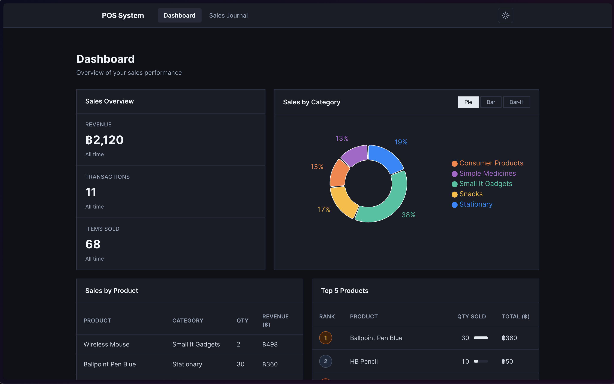

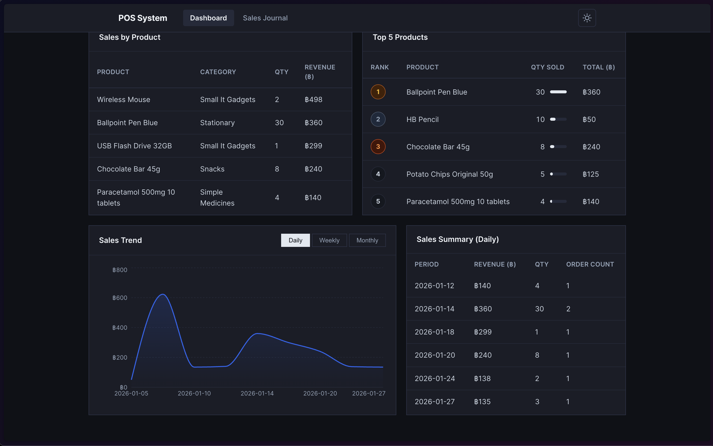

#### All time Summaries
An easy overview that shows total revenue, total transactions and total items sold of all time.
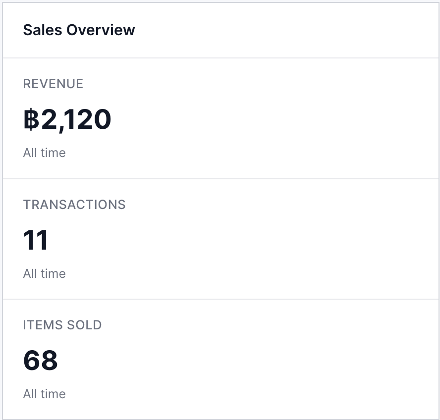

#### Sales Category
Sales data divided by category viewable with 3 different types of charts ( Pie Chart, Bar Graph, Horizontal Bar Graph).

##### Pie Chart View

##### Bar Graph View

##### Horizontal Bar graph view

#### Sales by product table
Sales of each product of all time
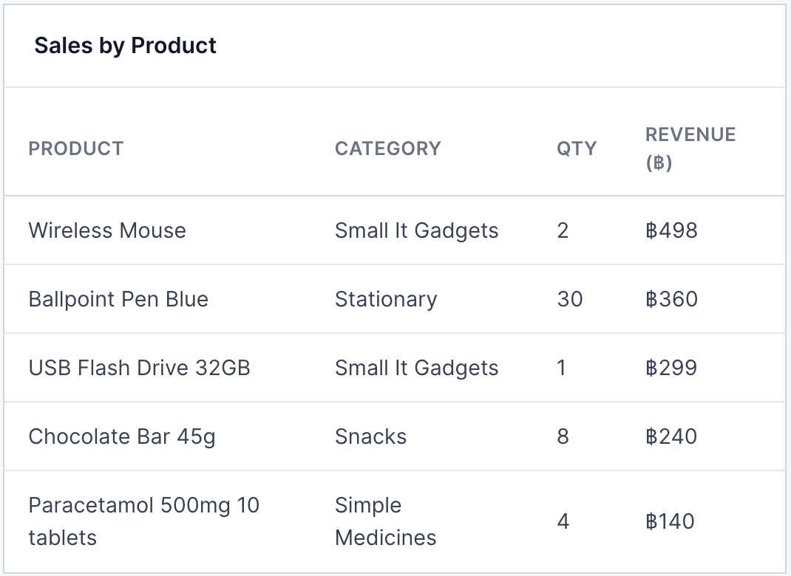

#### Top 5 best-selling products table
List the top 5 best selling of all time.
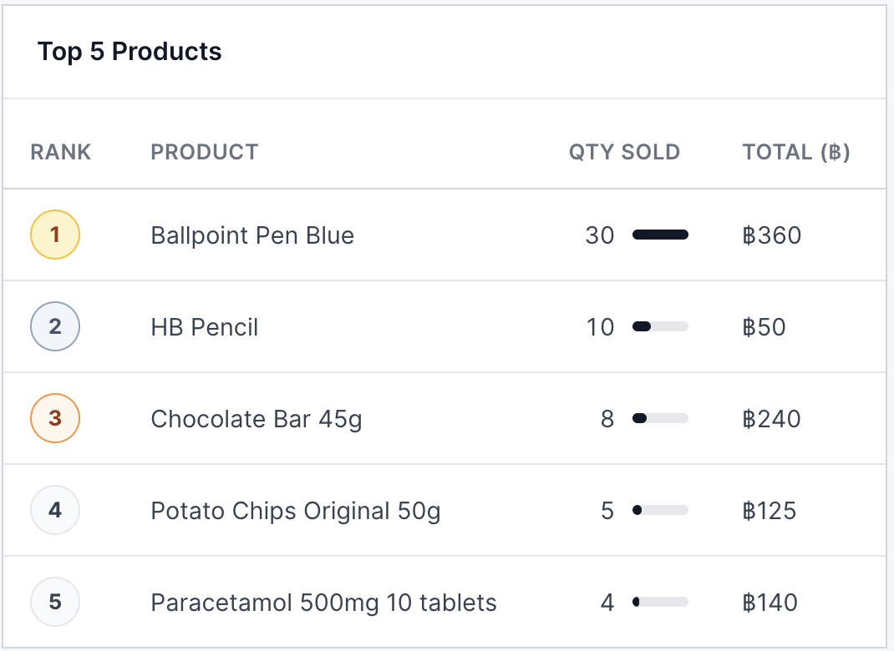

#### Sales Trend
Sales trends shown by days, weeks, or months.

#### Daily sales summary
Daily sales summary showing revenue, quantity, and order count by days, weeks or months. The toggle for this is tied to the sale trend. 

---

### Sales Journal Page 

The Sales Journal page allows users to record sales transactions by selecting a product, entering quantity, and choosing a date.
#### Light Mode
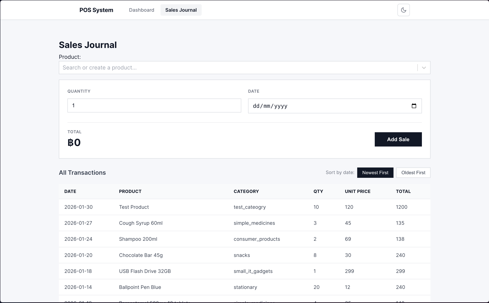

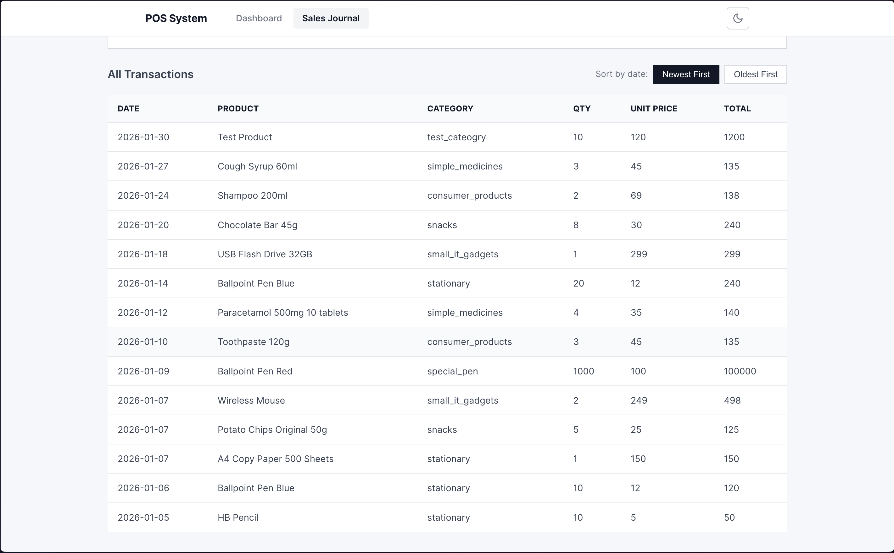

#### Dark Mode
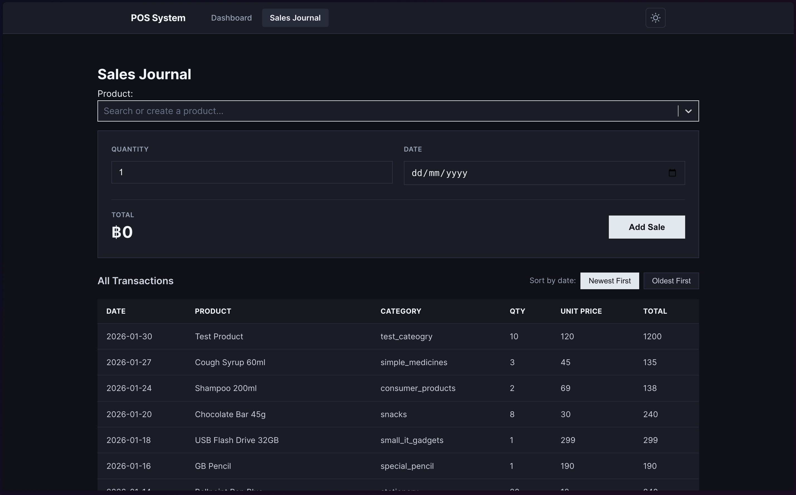

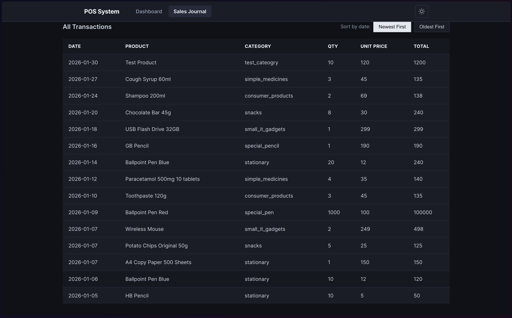

#### Add a Sale
Users record a sale by selecting a product, entering quantity, and choosing a date.
The system automatically calculates the total price for each transaction.

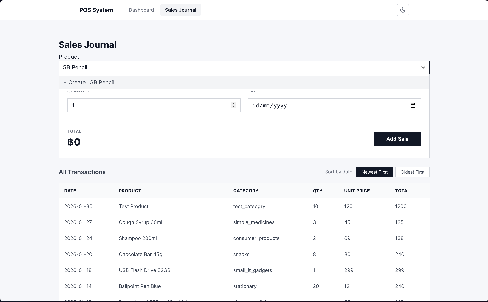

##### Successful Popup
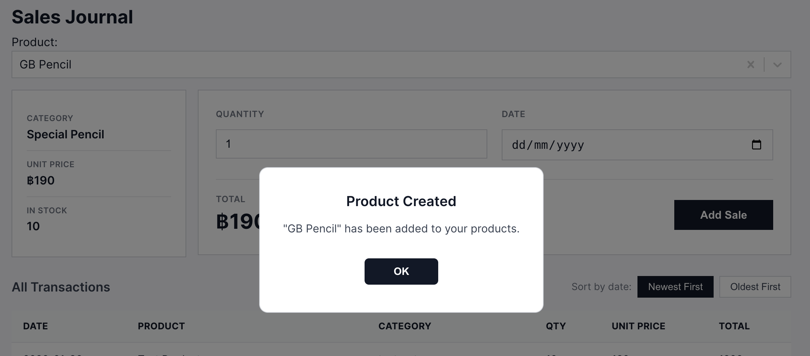

##### Warning Popup
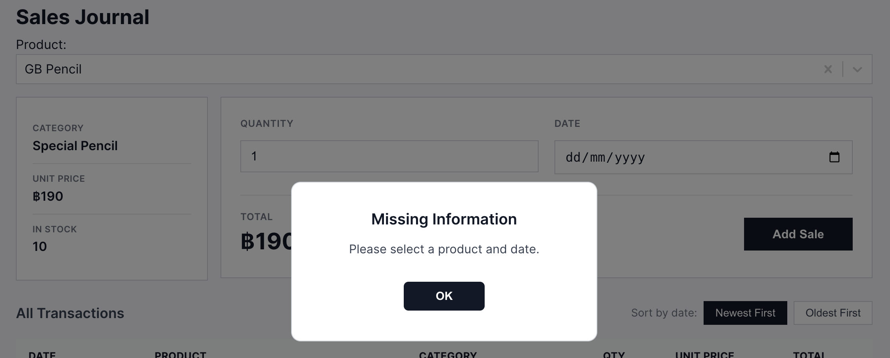

#### Add a New Product
if the product the user wants to insert don't exist they can just type it in the dropdown box and click create or press the enter key.

##### Add a New Product Form
This form will show up for the user to add it to the product list. The user can add a product by filling in the category, Unit price, Inventory and a short description ( optional )
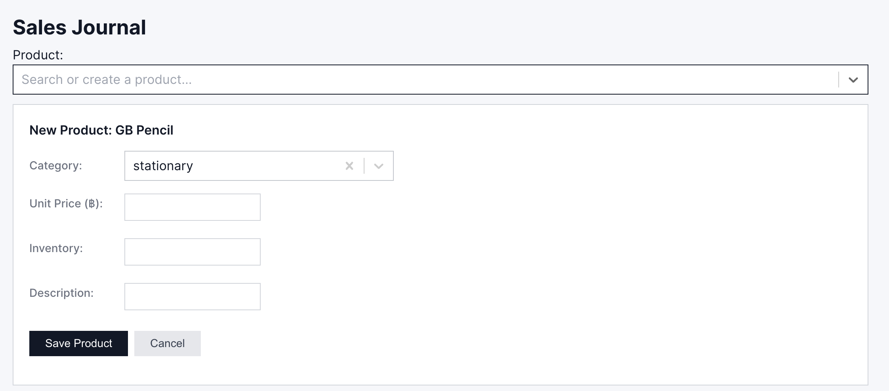

##### Add a new category
If a category don't exist the user can create it by simply typing it in the categories dropdown box.
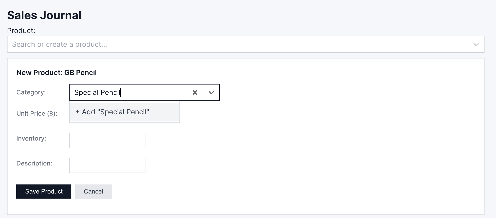
###### Category added
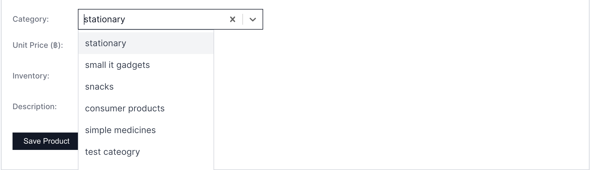

##### Warning Popup

##### Successful Popup

##### Added Product Information
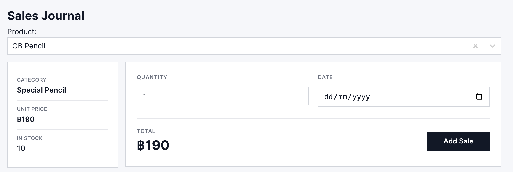

#### Sales History Tables
All recorded sales are displayed in a table that includes: Date, Product, Category, Quantity, Unit Price and Total Amount. Which be sorted by date.

##### Sort New
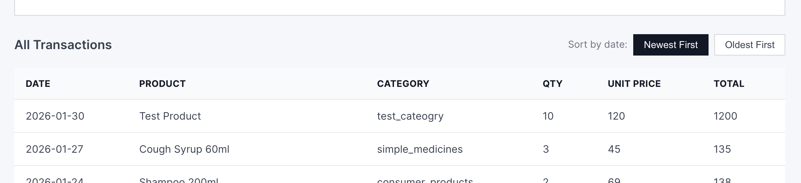

##### Sort Old
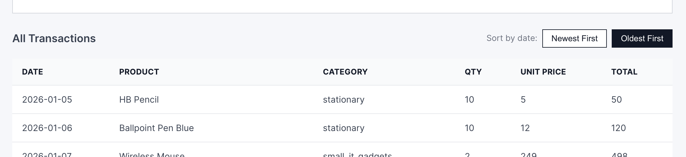