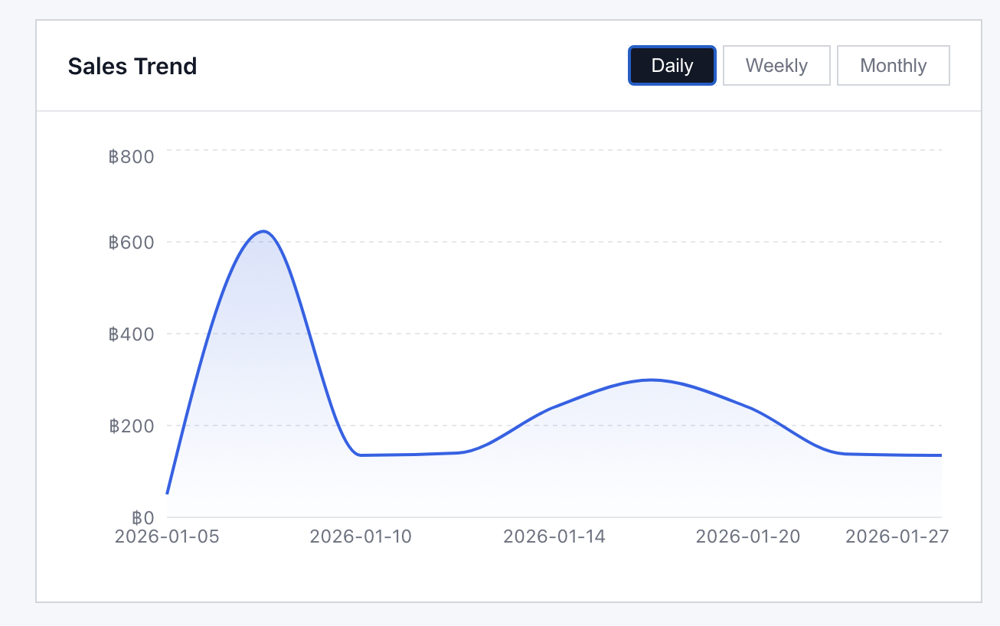
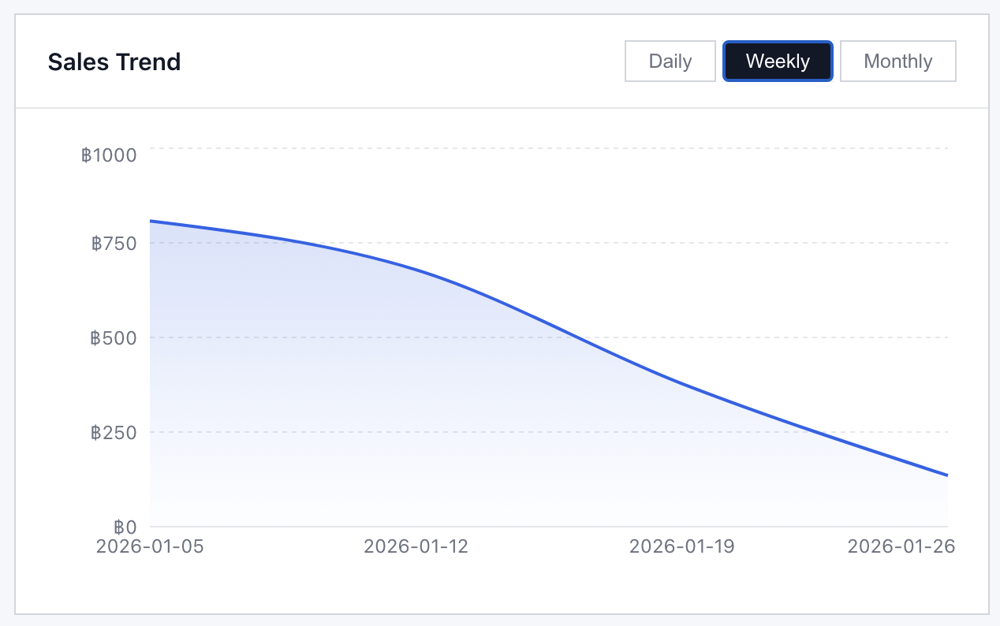
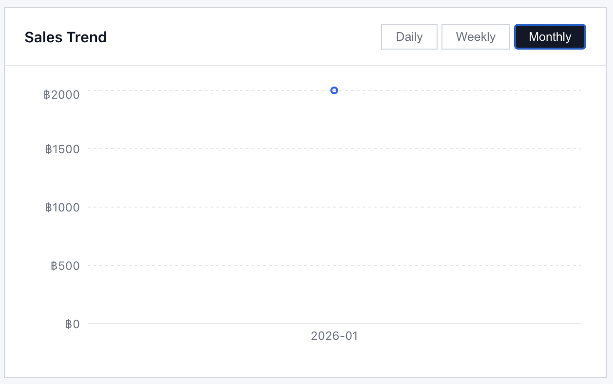
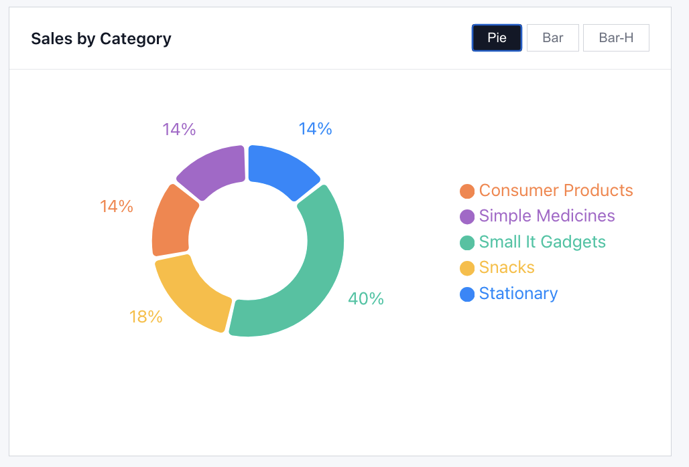
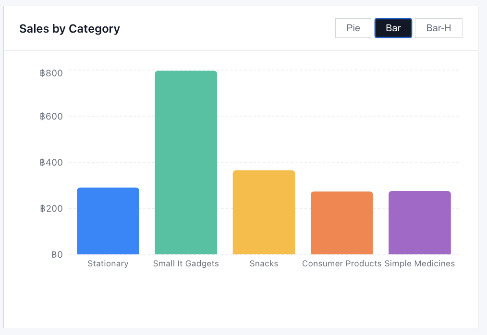
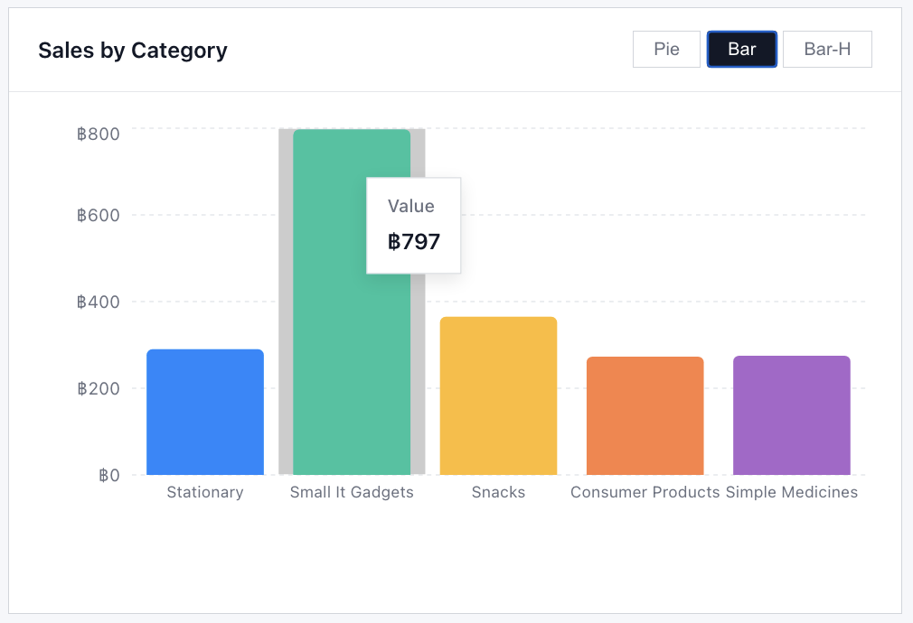
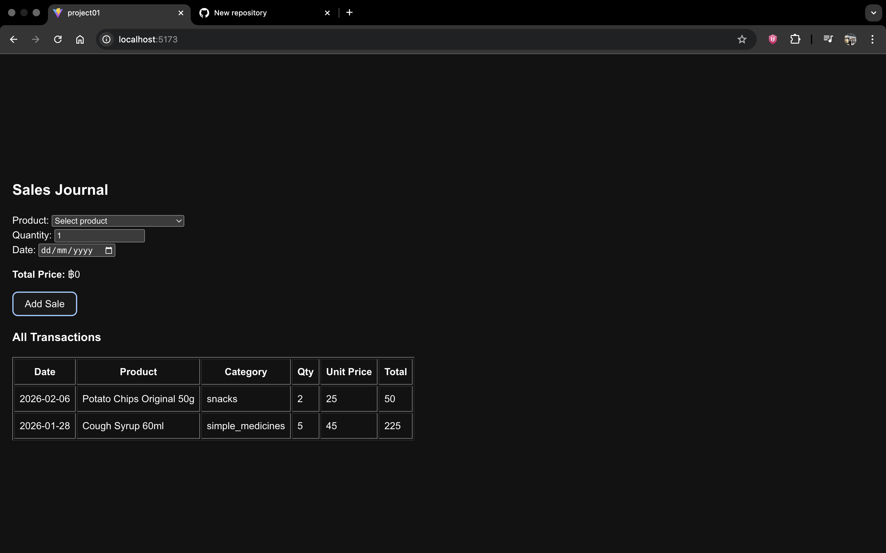
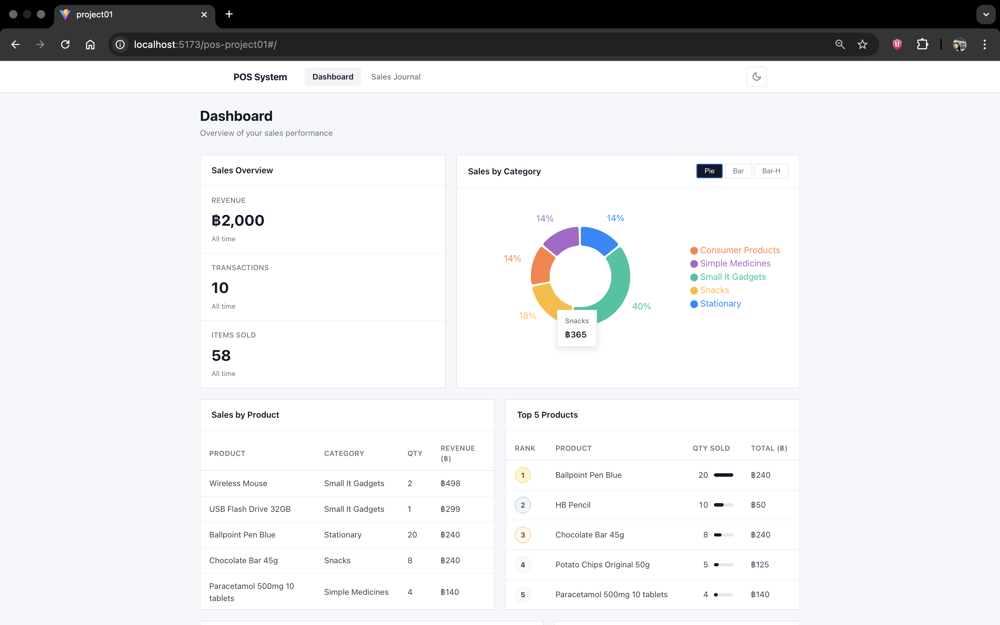
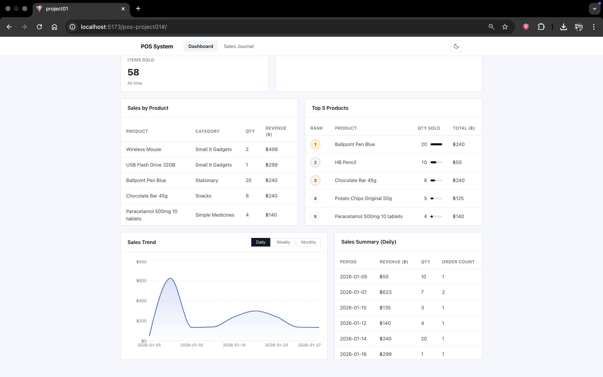
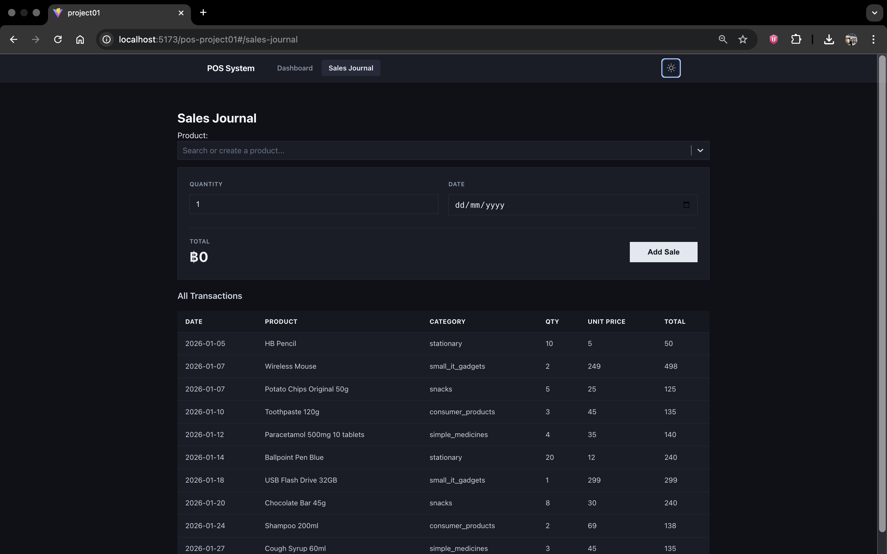

# Project 01: Ba POS (Updated)

## Technology Used

| Category           | Technology           | Description                          |
|--------------------|----------------------|--------------------------------------|
| Main Framework     | React                | Frontend UI framework                |
| Routing Library    | react-router-dom     | Client-side page routing             |
| Chart Library      | Recharts             | Charts and data visualization        |
| UI Utility Library | react-select         | Input searchable dropdown components |
| Package Manager    | npm                  | Dependency and package management    |

## Group Members
- Kyaw Zeyar Hein 
- Min Khaung Kyaw Swar 

## Deployment
GitHub Pages link: https://kyawzeyarhein.github.io/pos-project01/

Overview

This project is a Point of Sale (POS) web application developed using React.
The system allows users to record sales transactions, view transaction history, and analyze sales performance through visual summaries and charts.

The application uses LocalStorage to store sales data and does not require a backend server or database.

Features
--Sales 

The Sales Journal page allows users to record sales transactions by selecting a product, entering quantity, and choosing a date.
The system automatically calculates the total price for each transaction.

All recorded transactions are displayed in a table that includes:Date, Product, Category, Quantity, Unit Price and Total Amount
### Sales Trend

### Sales Category

### Sales Journal

--Dashboard

The Dashboard provides an overview of sales performance and analytics.
It displays summary information such as total revenue, number of transactions, and total items sold.

The dashboard also includes:
Sales by category displayed as a chart
Sales trends shown by day, week, or month
Sales by product table
Top 5 best-selling products
Daily sales summary showing revenue, quantity, and order count
### Dashboard

--Dark Mode

The application includes a light mode and dark mode toggle to improve user experience and readability.
### Dark Mode

